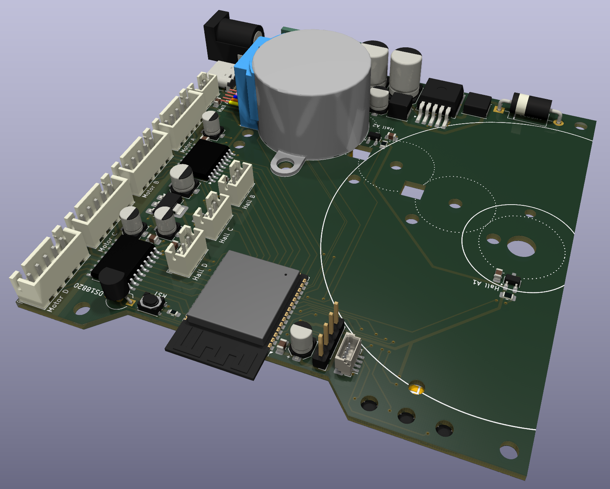
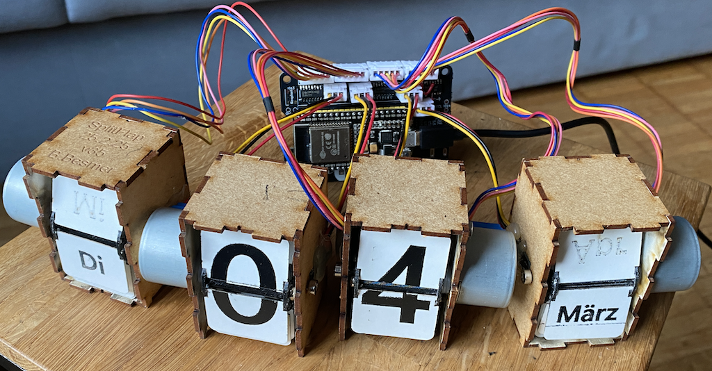

Driver board for four 28BYJ-48 stepper motors.

## Version 2.0

## Version 1.0

## Credits

- Credits for the [ESP32 Devkit 3d model](https://grabcad.com/library/esp32-devkitc-v4-1) by [Andrei Golyakov](https://grabcad.com/andrei.golyakov-1)
- Credits for the [SK6814mini 3d model](https://grabcad.com/library/sk6812-mini-sk6814-smd3535-1) by [Laur V](https://grabcad.com/laur.v-1)
