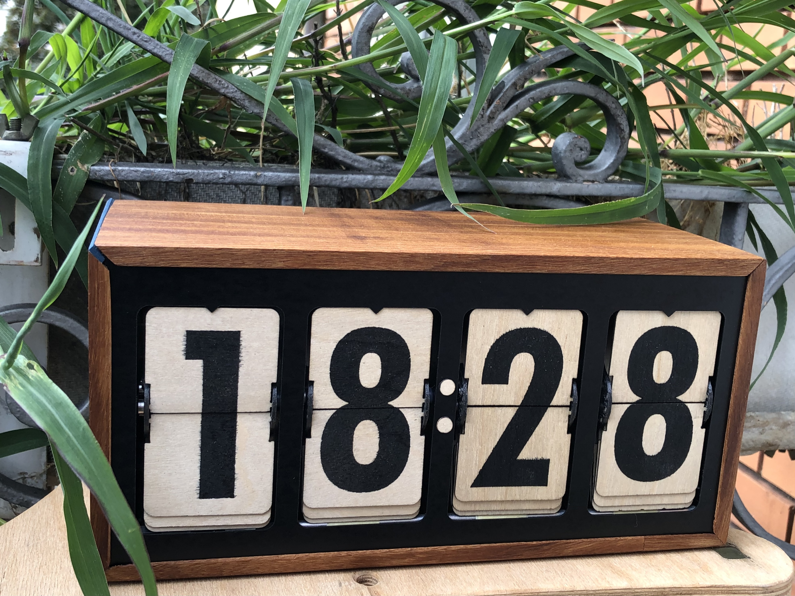
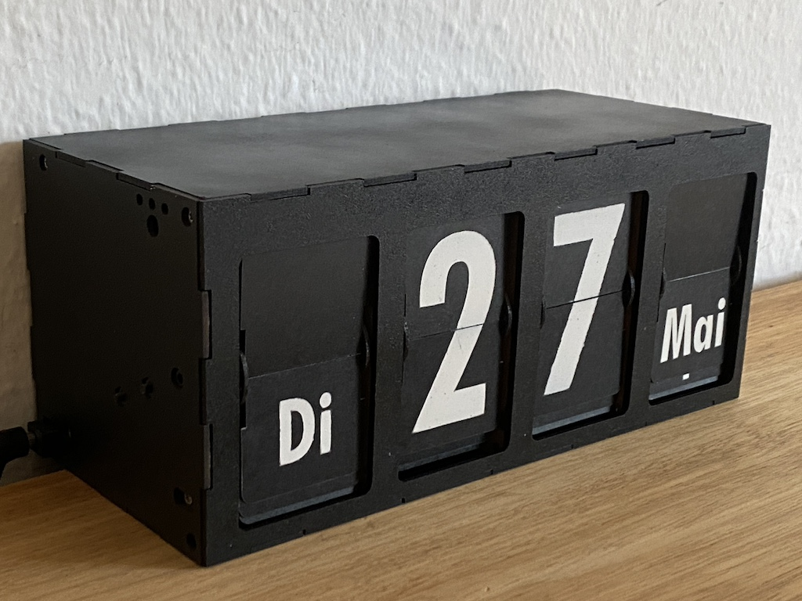
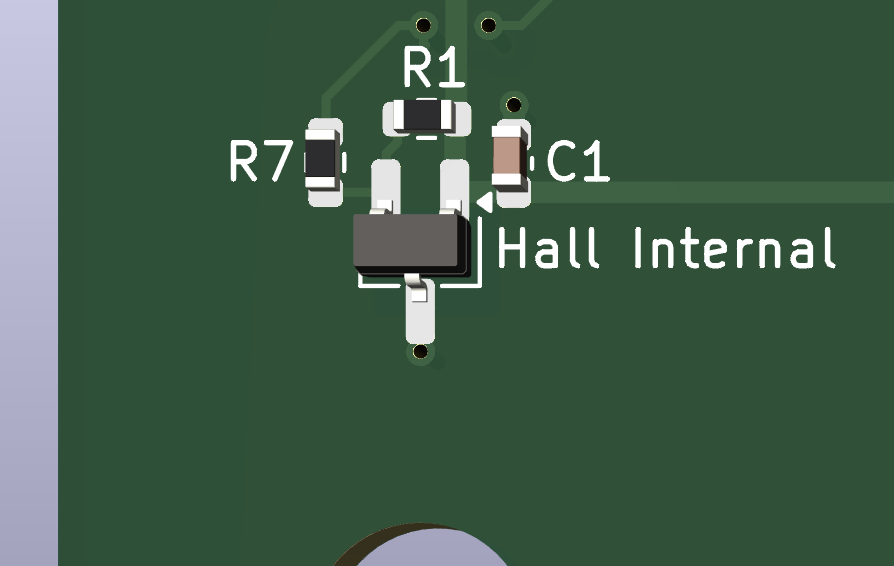
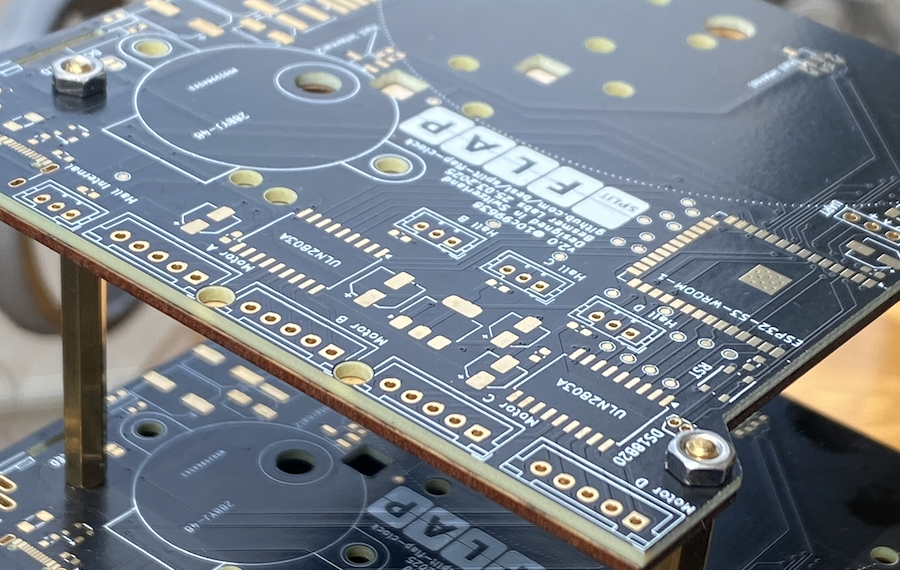
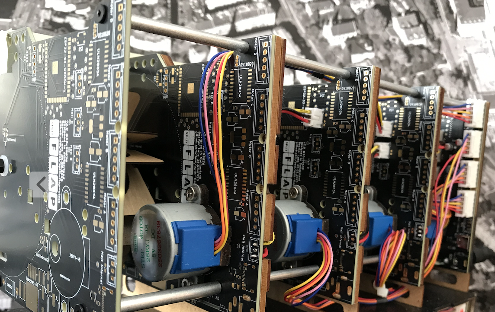
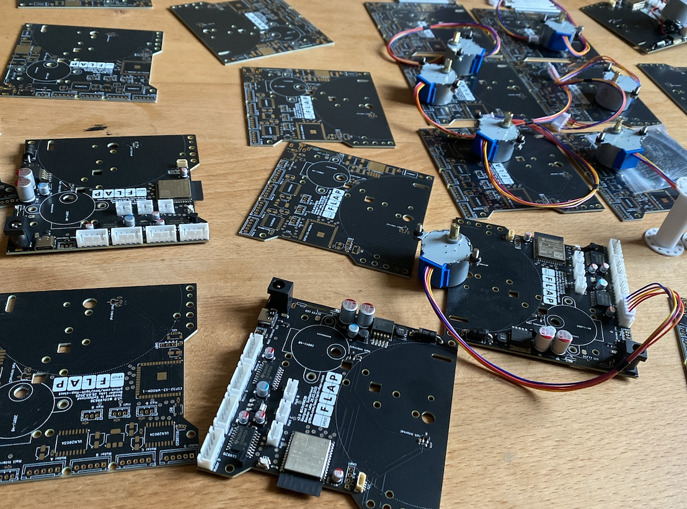
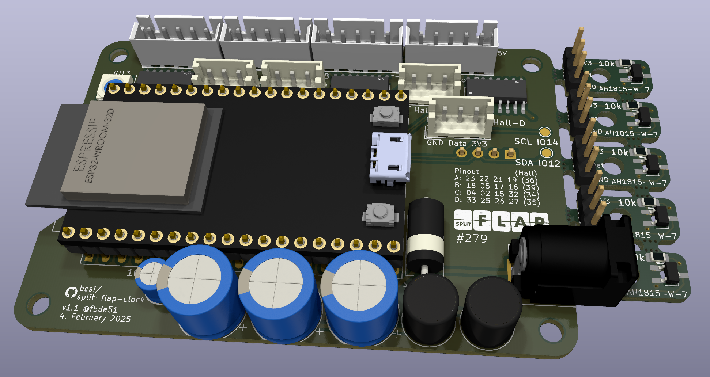

Split Flap clock or calendar utilising four 28BYJ-48 stepper motors.

## Bill of materials

What is needed for one digit.

| Count | Item                 | Description                       |
|-------|----------------------|-----------------------------------|
| 1     | PCB v2.0             |                                   |
| 1     | Supporting Plate     | Same shape and holes like the PCB |
| 1     | Spacer 2mm           | Spacer for cogwheels              |
| 1     | Hall sensor AH1815-W7| For the unpopulated PCBs only     |
| 1     | 10k Resistor 0306    | For the unpopulated PCBS          |
| 1     | Spool                | 3-D Print with M3 heat insert     |
| 1     | Spool lid            | 3-D Print                         |
| 1     | Cog Stepper          | 3-D Print / Laser cut             |
| 1     | Cog M3               | 3-D Print / Laser cut             |
| 1     | Cog M3 Nut           | 3-D Print / Laser cut             |
| 1     | Magnet 2x1mm         | For spool                         |
| 1     | Motor 28BYJ-48       | 5V Version                        |
| 1     | Motor gasket         | Laser cut                         |
| 12    | Flaps                | Laser cut Flaps                   |
| 1     | 3 Pos JST 2mm Socket | Hall sensor Connection            |
| 1     | 3 Pos JST 2mm Cable  | Hall sensor Connection            |
| 4     | M3 Nuts              | 2 Cogs, 2 Motor                   |
| 5     | M3x8mm Bolt          | 2 Cogs,2 Motor, Spindle,          |
| 3     | M3x5mm Bolt          | 3 Spindle                         |
| 4     | M3 Standoffs 50mm    | Male-Female 6mm thread            |
| 4     | M2.5 Screws          | For Standoffs                     |
| 1     | Washer 5mm 1mm thick | For Driver cogwheel               |
| 2     | Washer 3mm 1mm thick | For cogwheels                     |
| 1     | Zip tie for motor    |                                   |

## Pinout

Motors: 

| Pins        | 1  | 2  | 3  | 4  | Hall  |
|-------------|----|----|----|----|-------|
| **Motor A** | 10 | 9  | 3  | 8  | 18 (7)|
| **Motor B** | 13 | 14 | 21 | 11 | 12    |
| **Motor C** | 40 | 39 | 38 | 6  | 47    |
| **Motor D** | 1  | 2  | 42 | 41 | 48    |

Other GPIOs

| Function       | Pin |
|----------------|-----|
| DCF-77         | 4   |
| SDA / Switch B | 16  |
| SCL / Switch A | 17  |
| Mode           | 0   |
| Neopixel       | 15  |
| Temperature    | 5   |

## Assembly

One assembled PCB which functions as the main board can drive four split flap digits including itself as well as three additional passive digits. Looking from the front of the clock / calendar the unit with the populated PCB is to the very left with the barrel jack protruding outward to the left side.

- On the three unpopulated PCBs the Hall sensors circuitry above the spool axis has to be provided. For this R7 can be shortened using a solder bridge, the Hall sensor (AH1815-W7) as well as the R1 resistor (10k 0603) need to be mounted. C1 (100nF 0603) can be omitted:  

- Using M3x5 screws mount all four motors directly to the corresponding PCB using the spacer where it says "28BYJ-48". The nuts go to the other side of the PCB where the spacer has two cutouts for both nuts.

- On the main board connect the motor to the "Motor A" connector. The cable can be looped and secured using a zip tie threaded through the two holes next to the motor.

- On the main board solder the three switches and the RGB LED to the backside of the PCB.

- Solder the DCF77 connector to the pcb and temporarily tape the ferrite antenna to the PCB to protect the thin copper wires from the coil around the antenna.

- Add cog wheels with the M3x8 screws on two different sides
- Add the spacer
- Add the cover
- Connect all hall sensors
- Prepare the spool 
- Add standoffs female-female or standoffs male-female respectively

- The driving cog wheel is assembled as follows:

        M3x16 + 5 washers + m3-nut-cog + 3 washers

## The PCB

[PCBWay][pcbway] kindly offered to sponsor the manufacturing and assembly of the second iteration of this pcb.

[][pcbway]

In this project the PCBs are used in both the electrical as well as the mechanical realm. The motors and cog wheels are directly mounted onto the pcb and for one clock or calendar four pcbs are stacked together.

The PCBs turned out flawlessly and the ordering process was smooth and efficient.

[pcbway]: https://pcbway.com/g/2jc702

### PCB V2.0

### PCB V1.0

## Flashing the PCB

    cd ~/Downloads
    IMAGE=ESP32_GENERIC_S3-20251209-v1.27.0.bin
    wget https://micropython.org/resources/firmware/$IMAGE -nc
    PORT=/dev/cu.usbmodem14401
    esptool.py --port $PORT erase_flash
    esptool.py --port $PORT --baud 460800 write_flash --flash_size=detect 0 $IMAGE --flash_mode=dout

## Credits

### 3d models
- Credits for the [ESP32 Devkit 3d model](https://grabcad.com/library/esp32-devkitc-v4-1) by [Andrei Golyakov](https://grabcad.com/andrei.golyakov-1)
- Credits for the [SK6814mini 3d model](https://grabcad.com/library/sk6812-mini-sk6814-smd3535-1) by [Laur V](https://grabcad.com/laur.v-1)

### Markdown tables

The Markdown tables were generated using the fabulous tool called [tableconvert](https://tableconvert.com/markdown-generator).
